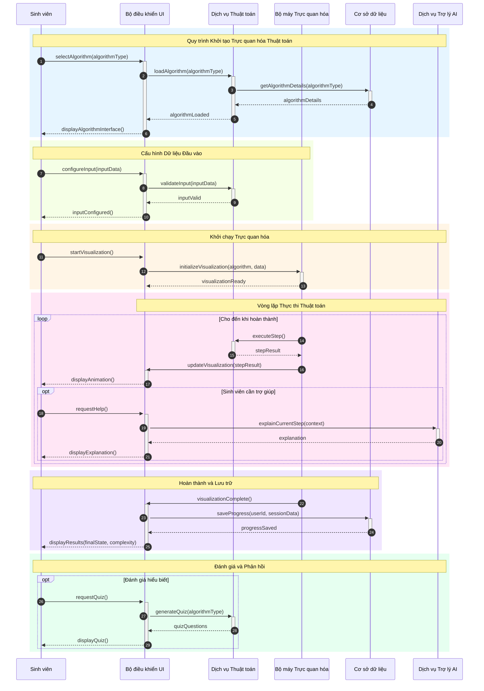

# Sequence Diagram: Algorithm Visualization Process

```mermaid
sequenceDiagram
    participant S as Sinh viên
    participant UI as Bộ điều khiển UI
    participant AS as Dịch vụ Thuật toán
    participant VE as Bộ máy Trực quan hóa
    participant DB as Cơ sở dữ liệu
    participant AI as Dịch vụ Trợ lý AI

    autonumber
    
    rect rgb(230, 245, 255)
    Note over S,AI: Quy trình Khởi tạo Trực quan hóa Thuật toán
    S->>+UI: selectAlgorithm(algorithmType)
    UI->>+AS: loadAlgorithm(algorithmType)
    AS->>+DB: getAlgorithmDetails(algorithmType)
    DB-->>-AS: algorithmDetails
    AS-->>-UI: algorithmLoaded
    UI-->>-S: displayAlgorithmInterface()
    end

    rect rgb(245, 255, 230)
    Note over S,VE: Cấu hình Dữ liệu Đầu vào
    S->>+UI: configureInput(inputData)
    UI->>+AS: validateInput(inputData)
    AS-->>-UI: inputValid
    UI-->>-S: inputConfigured()
    end

    rect rgb(255, 245, 230)
    Note over S,AI: Khởi chạy Trực quan hóa
    S->>+UI: startVisualization()
    UI->>+VE: initializeVisualization(algorithm, data)
    VE-->>-UI: visualizationReady
    end

    rect rgb(255, 230, 245)
    Note over UI,AI: Vòng lặp Thực thi Thuật toán
    loop Cho đến khi hoàn thành
        VE->>+AS: executeStep()
        AS-->>-VE: stepResult
        VE->>+UI: updateVisualization(stepResult)
        UI-->>-S: displayAnimation()
        
        opt Sinh viên cần trợ giúp
            S->>+UI: requestHelp()
            UI->>+AI: explainCurrentStep(context)
            AI-->>-UI: explanation
            UI-->>-S: displayExplanation()
        end
    end
    end

    rect rgb(240, 230, 255)
    Note over S,DB: Hoàn thành và Lưu trữ
    VE->>+UI: visualizationComplete()
    UI->>+DB: saveProgress(userId, sessionData)
    DB-->>-UI: progressSaved
    UI-->>-S: displayResults(finalState, complexity)
    end

    rect rgb(230, 255, 240)
    Note over S,AI: Đánh giá và Phản hồi
    opt Đánh giá hiểu biết
        S->>+UI: requestQuiz()
        UI->>+AS: generateQuiz(algorithmType)
        AS-->>-UI: quizQuestions
        UI-->>-S: displayQuiz()
    end
    end
```
