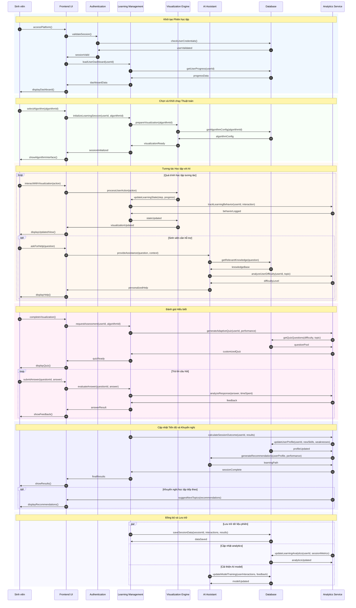

# Sequence Diagram: Complete Learning System Interaction

```mermaid
sequenceDiagram
    participant S as Sinh viên
    participant UI as Frontend UI
    participant Auth as Authentication
    participant LMS as Learning Management
    participant VE as Visualization Engine
    participant AI as AI Assistant
    participant DB as Database
    participant Analytics as Analytics Service

    autonumber

    rect rgb(240, 248, 255)
    Note over S,Analytics: Khởi tạo Phiên học tập
    S->>UI: accessPlatform()
    UI->>Auth: validateSession()
    Auth->>DB: checkUserCredentials()
    DB->>Auth: userValidated
    Auth->>UI: sessionValid
    UI->>LMS: loadUserDashboard(userId)
    LMS->>DB: getUserProgress(userId)
    DB->>LMS: progressData
    LMS->>UI: dashboardData
    UI->>S: displayDashboard()
    end

    rect rgb(248, 255, 248)
    Note over S,Analytics: Chọn và Khởi chạy Thuật toán
    S->>UI: selectAlgorithm(algorithmId)
    UI->>LMS: initializeLearningSession(userId, algorithmId)
    LMS->>VE: prepareVisualization(algorithmId)
    VE->>DB: getAlgorithmConfig(algorithmId)
    DB->>VE: algorithmConfig
    VE->>LMS: visualizationReady
    LMS->>UI: sessionInitialized
    UI->>S: showAlgorithmInterface()
    end

    rect rgb(255, 248, 240)
    Note over S,Analytics: Tương tác Học tập với AI
    loop Quá trình học tập tương tác
        S->>UI: interactWithVisualization(action)
        UI->>VE: processUserAction(action)
        VE->>LMS: updateLearningState(step, progress)
        LMS->>Analytics: trackLearningBehavior(userId, interaction)
        Analytics->>LMS: behaviorLogged
        LMS->>VE: stateUpdated
        VE->>UI: visualizationUpdated
        UI->>S: displayUpdatedView()
        
        opt Sinh viên cần hỗ trợ
            S->>UI: askForHelp(question)
            UI->>AI: provideAssistance(question, context)
            AI->>DB: getRelevantKnowledge(question)
            DB->>AI: knowledgeBase
            AI->>Analytics: analyzeUserDifficulty(userId, topic)
            Analytics->>AI: difficultyLevel
            AI->>UI: personalizedHelp
            UI->>S: displayHelp()
        end
    end
    end

    rect rgb(255, 240, 248)
    Note over S,Analytics: Đánh giá Hiểu biết
    S->>UI: completeVisualization()
    UI->>LMS: requestAssessment(userId, algorithmId)
    LMS->>Analytics: generateAdaptiveQuiz(userId, performance)
    Analytics->>DB: getQuizQuestions(difficulty, topic)
    DB->>Analytics: questionPool
    Analytics->>LMS: customizedQuiz
    LMS->>UI: quizReady
    UI->>S: displayQuiz()
    
    loop Trả lời câu hỏi
        S->>UI: submitAnswer(questionId, answer)
        UI->>LMS: evaluateAnswer(questionId, answer)
        LMS->>Analytics: analyzeResponse(answer, timeSpent)
        Analytics->>LMS: feedback
        LMS->>UI: answerResult
        UI->>S: showFeedback()
    end
    end

    rect rgb(240, 240, 255)
    Note over S,Analytics: Cập nhật Tiến độ và Khuyến nghị
    LMS->>Analytics: calculateSessionOutcome(userId, results)
    Analytics->>DB: updateUserProfile(userId, newSkills, weaknesses)
    DB->>Analytics: profileUpdated
    Analytics->>AI: generateRecommendations(userProfile, performance)
    AI->>Analytics: learningPath
    Analytics->>LMS: sessionComplete
    LMS->>UI: finalResults
    UI->>S: showResults()
    
    opt Khuyến nghị học tập tiếp theo
        Analytics->>UI: suggestNextTopics(recommendations)
        UI->>S: displayRecommendations()
    end
    end

    rect rgb(248, 248, 255)
    Note over S,Analytics: Đồng bộ và Lưu trữ
    par Lưu trữ dữ liệu phiên
        LMS->>DB: saveSessionData(sessionId, interactions, results)
        DB->>LMS: dataSaved
    and Cập nhật analytics
        Analytics->>DB: updateLearningAnalytics(userId, sessionMetrics)
        DB->>Analytics: analyticsUpdated
    and Cải thiện AI model
        AI->>DB: updateModelTraining(userInteractions, feedback)
        DB->>AI: modelUpdated
    end
    end
```
